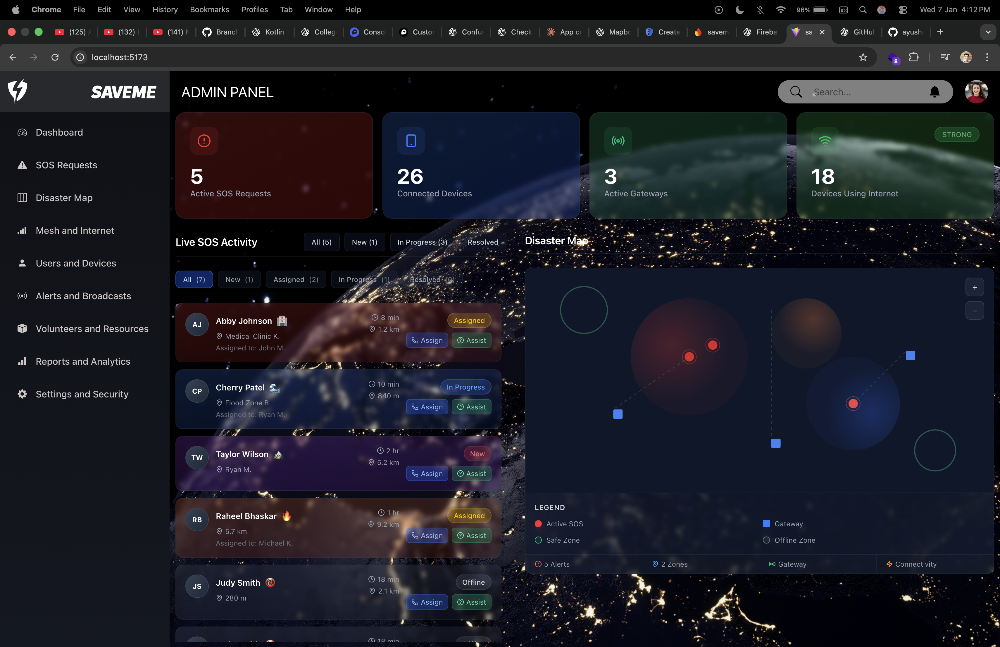
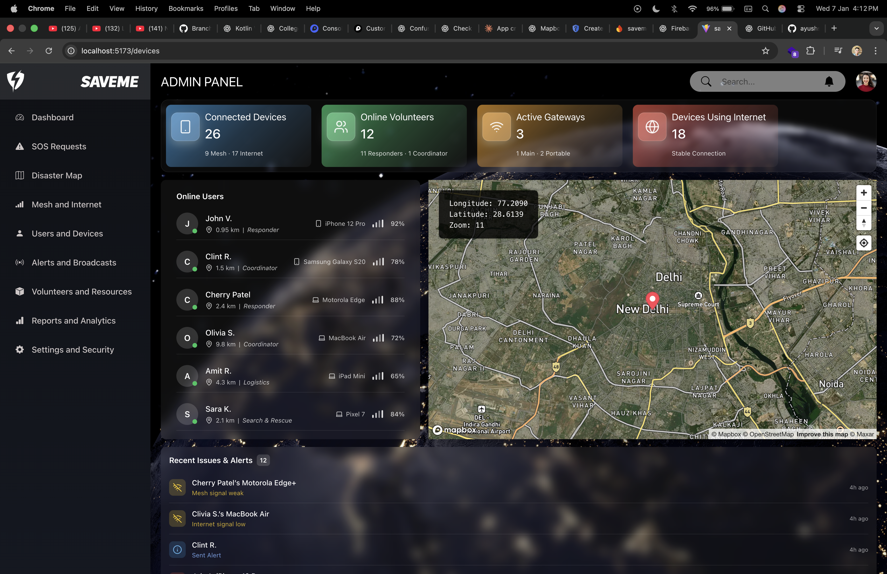
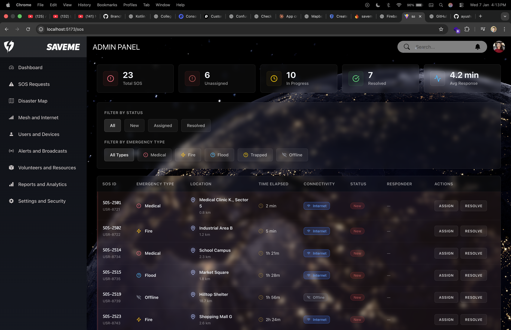

# 🚨 SaveMe – SOS App Admin Dashboard

> A powerful and modern admin panel to monitor, manage, and respond to emergency SOS alerts in real-time.

The **SaveMe Admin Dashboard** is designed for emergency operators, administrators, and responders to efficiently handle SOS requests, track users and devices, monitor live locations, and ensure rapid response during critical situations.

---

## ✨ Features

- 📍 **Live Location Tracking** — View real-time locations of users who trigger SOS.
- 👥 **Online Users & Devices** — Monitor currently active users and connected devices.
- 🚨 **SOS Alerts Management** — View, prioritize, and act on incoming emergency alerts.
- 🗺 **Interactive Map View** — Visualize emergencies and responders on a live map.
- 📊 **Dashboard Analytics** — Quick overview of system activity and response status.
- 🔐 **Role-based Access** — Secure admin access for authorized personnel only.
- 🌙 **Modern Dark UI** — Clean, distraction-free interface optimized for control rooms.

---

## 🖥 Tech Stack

| Layer | Technology |
|------|-----------|
Frontend | React + Vite |
Styling | CSS / Tailwind (if used) |
Maps | Mapbox |
State | React Hooks / Context |
Backend | Firebase / Node (as applicable) |
Auth | Firebase Auth |
Hosting | Vercel / Firebase / Custom |

---

## 📸 Screenshots

